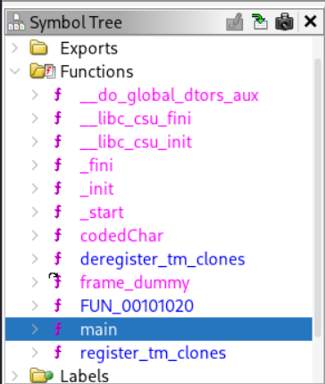
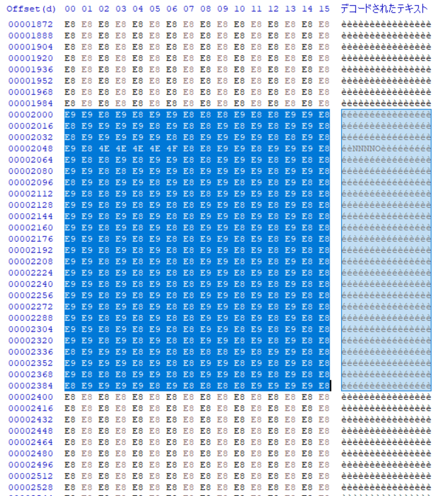

# Investigative Reversing 2
Author: Santiago C/Danny T  

### URL
https://play.picoctf.org/practice/challenge/13  

### Description
We have recovered a binary and an image See what you can make of it. There should be a flag somewhere.  

<br>
<br>
<br>
<br>

## 解答の過程
binaryをクリックすることでファイル名「mystery」というファイルを、imageをクリックすることでファイル名「encoded.bmp」というファイルをダウンロードすることができます。  
Linuxのfileコマンドで確認してみます。  
encoded.bmpはビットマップファイルなので、開いてみると多数の図形が描かれている図が表示されます。意味不明です。  
mysteryはバイナリーファイルであることが分かります。  

```
$ file encoded.bmp 
encoded.bmp: PC bitmap, Windows 3.x format, 1765 x 852 x 8, image size 1506336, cbSize 1507414, bits offset 1078

$ file mystery 
mystery: ELF 64-bit LSB pie executable, x86-64, version 1 (SYSV), dynamically linked, interpreter /lib64/ld-linux-x86-64.so.2, for GNU/Linux 3.2.0, BuildID[sha1]=2d2155d1fe9b3de7809f36ce63468d6e9a9ebbf7, not stripped
```

mysteryはLinuxの実行形式ファイルであるため、試しに実行してみます。  
「No flag found, ・・・」のメッセージとともにセグメンテーションフォールトを発生させて終了しました。  

```
$ ./mystery           
No flag found, please make sure this is run on the server
original.bmp is missing, please run this on the server
zsh: segmentation fault  ./mystery
```

出力されたメッセージなどを手掛かりにして、バイナリーファイルの内容を解析した方が良さそうです。オープンソースのリバースエンジニアリングツールである[Ghidra](https://ja.wikipedia.org/wiki/Ghidra)を使って、バイナリーファイルを解析してみます。  

#### ◆ Ghidraでの解析
Ghidraを起動すると、プロジェクトの管理画面が表示されます。  
適当なプロジェクトを用意し、そこにmysteryファイルをインポートします。  
インポート時に提案されるフォーマットなどの項目は、そのままにしてOKボタンを押して先に進みます。  
プロジェクト内にインポートされたmysteryファイルをダブルクリックして、CodeBrowserを立ち上げます。  
mysteryファイルが解析されていない場合は、Ghidraから解析するか提案されるのでYesボタンをして解析させます。解析オプションは何も変更せずに、Analyzeボタンを押して解析させます。  
解析が終わると、CodeBrowser画面に戻ります。リバースエンジニアリングされたmysteryファイルのコードが表示されています。  
このコードを見ても何が何だか分からないので、C言語としてデコンパイルさせ、内容を確認していきます。  
まず、画面左にあるSymbol TreeウィンドウのFunctionsを開き、その中からmysteryの主要な処理になっていそうな関数を探します。幸い、mainという名称の関数が存在していたので、クリックします。するとアセンブリーコードが該当箇所に移動して表示されます。  


次に、メニューから「Window」→「Decompiler」を選択すると、C言語でデコンパイルされたコードが表示されます。  


デコンパイルされたC言語のコードは変数の名前などがGhidraによって自動的に付けられているため、把握しづらい状態です。リネームやリファクタリングなどを実施して整理していきます。  

整理したコードは以下のようになります。  

```
int main(void)
{
  size_t sVar1;
  char byte_data_a;
  char byte_data_b;
  int int_value_a;
  int int_value_b;
  FILE *flag_txt;
  FILE *original_bmp;
  FILE *encoded_bmp;
  char flag_string [56];
  
  flag_txt = fopen("flag.txt","r");
  original_bmp = fopen("original.bmp","r");
  encoded_bmp = fopen("encoded.bmp","a");

  if (flag_txt == (FILE *)0x0) {
    puts("No flag found, please make sure this is run on the server");
  }

  if (original_bmp == (FILE *)0x0) {
    puts("original.bmp is missing, please run this on the server");
  }

  sVar1 = fread(&byte_data_a,1,1,original_bmp);
  int_value_a = (int)sVar1;

  for (int i = 0; i < 2000; i = i + 1) {
    fputc((int)byte_data_a,encoded_bmp);
    sVar1 = fread(&byte_data_a,1,1,original_bmp);
    int_value_a = (int)sVar1;
  }

  sVar1 = fread(flag_string,0x32,1,flag_txt);
  int_value_b = (int)sVar1;

  if (int_value_b < 1) {
    puts("flag is not 50 chars");
    exit(0);
  }

  for (int j = 0; j < 0x32; j = j + 1) {
    for (int k = 0; k < 8; k = k + 1) {
      byte_data_b = codedChar(k,(int)(char)(flag_string[j] + -5),(int)byte_data_a);
      fputc((int)byte_data_b,encoded_bmp);
      fread(&byte_data_a,1,1,original_bmp);
    }
  }

  while (int_value_a == 1) {
    fputc((int)byte_data_a,encoded_bmp);
    sVar1 = fread(&byte_data_a,1,1,original_bmp);
    int_value_a = (int)sVar1;
  }

  fclose(encoded_bmp);
  fclose(original_bmp);
  fclose(flag_txt);
}
```

この整理したコードの内容を確認していきます。  

#### ◆ ファイルのオープンとチェック
```
  flag_txt = fopen("flag.txt","r");
  original_bmp = fopen("original.bmp","r");
  encoded_bmp = fopen("encoded.bmp","a");

  if (flag_txt == (FILE *)0x0) {
    puts("No flag found, please make sure this is run on the server");
  }

  if (original_bmp == (FILE *)0x0) {
    puts("original.bmp is missing, please run this on the server");
  }
```

flag.txt、original.bmp、encoded.bmpの3つのファイルをオープンしています。  
そして、flag.txtとoriginal.bmpのファイルの存在チェックをしています。  

#### ◆ 2000バイト分のコピー
```
  sVar1 = fread(&byte_data_a,1,1,original_bmp);
  int_value_a = (int)sVar1;

  for (int i = 0; i < 2000; i = i + 1) {
    fputc((int)byte_data_a,encoded_bmp);
    sVar1 = fread(&byte_data_a,1,1,original_bmp);
    int_value_a = (int)sVar1;
  }
```

original.bmpの先頭2000バイト分をencoded.bmpにコピーしています。  

#### ◆ フラグの読み込み
```
  sVar1 = fread(flag_string,0x32,1,flag_txt);
  int_value_b = (int)sVar1;

  if (int_value_b < 1) {
    puts("flag is not 50 chars");
    exit(0);
  }
```

flag.txtから50バイト分（0x32は10進数で50）を読み込んでいます。  
ファイルの名称からフラグであることが分かります。そして、フラグは50文字であることも分かります。  

#### ◆ フラグの処理
```
  for (int j = 0; j < 0x32; j = j + 1) {
    for (int k = 0; k < 8; k = k + 1) {
      byte_data_b = codedChar(k,(int)(char)(flag_string[j] + -5),(int)byte_data_a);
      fputc((int)byte_data_b,encoded_bmp);
      fread(&byte_data_a,1,1,original_bmp);
    }
  }
```

各フラグ文字（flag_string[j]）ごとにcodedChar()を8回呼び出して、何かしらの処理を実施しています。  
そして、処理された値をencoded.bmpに書き込んでいます。同時にoriginal.bmpから1バイト読み進めています。  
フラグ文字はここで-5されており、解読を困難にさせているものと思われます。  

#### ◆ 残りのデータのコピーとファイルのクローズ
```
  while (int_value_a == 1) {
    fputc((int)byte_data_a,encoded_bmp);
    sVar1 = fread(&byte_data_a,1,1,original_bmp);
    int_value_a = (int)sVar1;
  }

  fclose(encoded_bmp);
  fclose(original_bmp);
  fclose(flag_txt);
```

フラグ文字（flag_string[j]）の埋め込みが終わった後は、残りのBMPデータをコピーして、ファイルをクローズして終了です。  

#### ◆ codedChar()関数
```
byte codedChar(int param_1,byte param_2,byte param_3)

{
  byte local_20;
  
  local_20 = param_2;
  if (param_1 != 0) {
    local_20 = (byte)((int)(char)param_2 >> ((byte)param_1 & 0x1f));
  }
  return param_3 & 0xfe | local_20 & 1;
}
```

フラグ文字（flag_string[j]）に対して処理している関数です。何をやっているのか確認します。  

まず、呼び出し元の引数の内容から、  
- param_1・・・ビット位置（0〜7）です。
- param_2・・・加工されたフラグ文字（flag_string - 5）です。
- param_3・・・original.bmpから読み込んだ1バイトです。

処理内容としては、  
- ローカル変数にフラグ文字をセットする。
- ピット位置が0でなければ、フラグ文字を右へビット位置分シフトしてローカル変数にセットする。
- original.bmpから読み込んだ1バイトが0xfeで最下位ビットが0にされるので、ローカル変数（シフトされたフラグ文字のビットの最下位ビット）をOR演算して埋め込まれる。
- その結果を返す。

例：  
flag_stringが「A」（0x41 = 01000001）の場合、param_2 = 0x3C = 00111100（A - 5 = 0x41 - 5 = 65 - 5 = 60 = 0x3C = 00111100）になり、codedChar()のループ処理で1ビットずつ、8バイト分に渡ってencoded.bmpに書き込まれることになります。  

| `param_1` | `param_2 >> param_1` | `local_20 & 1`<br>（original.bmpの最下位ビットに埋め込まれる値） |
| --------- | -------------------- | ----------------------------------------------- |
| 0         | `00111100`           | 0                                               |
| 1         | `00011110`           | 0                                               |
| 2         | `00001111`           | 1                                               |
| 3         | `00000111`           | 1                                               |
| 4         | `00000011`           | 1                                               |
| 5         | `00000001`           | 1                                               |
| 6         | `00000000`           | 0                                               |
| 7         | `00000000`           | 0                                               |

このように、1文字 → 8ビット → 8バイトのBMPデータに分散して埋め込まれます。  

### ◆ フラグの埋め込み箇所
以上より、2000バイト目から50文字×8＝400バイト分のデータをencoded.bmpから読み取り、逆の手順で処理してやれば、フラグが得られることになります。  

下の図は、バイナリーエディターでencoded.bmpを開き、2000バイト目から400バイト分を選択した様子になります。  
0xe8と0xe9の値が多くを占めており、特徴のないデータです。  



### ◆ 復元
それでは、この400バイト分の値を取り出して、最下位ビットを取り出しつつ文字に戻してみます。  
Pythonでコードを書くと、以下のようになります。  
ファイル名は「decode.py」にしました。  

```
def unbits(bits, endian='big'):
    if len(bits) % 8 != 0:
        raise ValueError("ビット数は8の倍数である必要があります")

    bytes_out = bytearray()

    for i in range(0, len(bits), 8):
        byte_bits = bits[i:i+8]
        if endian == 'little':
            byte_bits = byte_bits[::-1]
        byte = 0
        for bit in byte_bits:
            byte = (byte << 1) | int(bit)
        print(f"byte_bits: {byte_bits}, byte: {byte}")
        bytes_out.append(byte)

    return bytes(bytes_out)

#from pwn import *

with open("encoded.bmp", "rb") as b:
    b.seek(2000)
    binary_string = ""
    for j in range(400):
        binary_string += str(ord(b.read(1)) & 1)

print(f"binary_string: {binary_string}")

char_string = unbits(binary_string, "little")
print(f"char_string: {char_string}")

for c in char_string:
    #if c == '\x00':
        #continue
    #print(chr(ord(c) + 5), end='')
    print(chr(c + 5), end='')

print("\n")
```

encoded.bmpファイルをバイナリーモードで開き、2000バイト目まで進めます。  
2000バイト目から1バイトずつ読み取り、1のAND演算で最下位ビットを取り出しつつbinary_stringにセットしていきます。  

その後、unbits()関数を呼び出します。  
unbits()関数では、8ビット分の文字列を１つのセットにして、1文字ずつ左にシフトしながら各ビットをOR演算して1バイトの文字として組み立てます。  
今回はリトルエンディアンなのでビット順が逆になります。  

そして、得られた文字列を1文字ずつ+5して元に戻します。  
これでフラグ文字列になります。  

以下が、実行したときの出力です。  

```
$ python3 decode.py
binary_string: 1101011000100110011110100101011001111100111100101000001001101110100101100111010011001110111101100101101011010100100101100111010011010100110101001101010011010100110101001101010011010100110101001101010011010100110101001101010011010100110101001101010011010100110101001101010011010100110101001101010011010100110101001101010011010100110101000111010000101100111101001101010010001100110101000111101000011110
byte_bits: 01101011, byte: 107
byte_bits: 01100100, byte: 100
byte_bits: 01011110, byte: 94
byte_bits: 01101010, byte: 106
byte_bits: 00111110, byte: 62
byte_bits: 01001111, byte: 79
byte_bits: 01000001, byte: 65
byte_bits: 01110110, byte: 118
byte_bits: 01101001, byte: 105
byte_bits: 00101110, byte: 46
byte_bits: 01110011, byte: 115
byte_bits: 01101111, byte: 111
byte_bits: 01011010, byte: 90
byte_bits: 00101011, byte: 43
byte_bits: 01101001, byte: 105
byte_bits: 00101110, byte: 46
byte_bits: 00101011, byte: 43
byte_bits: 00101011, byte: 43
byte_bits: 00101011, byte: 43
byte_bits: 00101011, byte: 43
byte_bits: 00101011, byte: 43
byte_bits: 00101011, byte: 43
byte_bits: 00101011, byte: 43
byte_bits: 00101011, byte: 43
byte_bits: 00101011, byte: 43
byte_bits: 00101011, byte: 43
byte_bits: 00101011, byte: 43
byte_bits: 00101011, byte: 43
byte_bits: 00101011, byte: 43
byte_bits: 00101011, byte: 43
byte_bits: 00101011, byte: 43
byte_bits: 00101011, byte: 43
byte_bits: 00101011, byte: 43
byte_bits: 00101011, byte: 43
byte_bits: 00101011, byte: 43
byte_bits: 00101011, byte: 43
byte_bits: 00101011, byte: 43
byte_bits: 00101011, byte: 43
byte_bits: 00101011, byte: 43
byte_bits: 00101011, byte: 43
byte_bits: 00101011, byte: 43
byte_bits: 00101011, byte: 43
byte_bits: 00101110, byte: 46
byte_bits: 00110100, byte: 52
byte_bits: 00101111, byte: 47
byte_bits: 00101011, byte: 43
byte_bits: 00110001, byte: 49
byte_bits: 00101011, byte: 43
byte_bits: 01011110, byte: 94
byte_bits: 01111000, byte: 120
char_string: b'kd^j>OAvi.soZ+i.++++++++++++++++++++++++++.4/+1+^x'
picoCTF{n3xt_0n300000000000000000000000000394060c}
```

<br>
<br>
<br>
<br>

## フラグ
picoCTF{n3xt_0n300000000000000000000000000394060c}  

<br>
<br>

## この問題は
バイナリーファイルの解析とステガノグラフィーを学ぶ問題のようです。  
