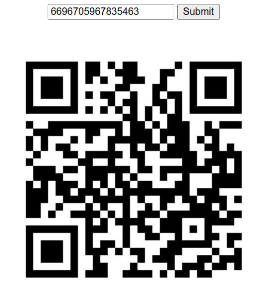

# Java Script Kiddie
Author: John Johnson  

#### URL
https://play.picoctf.org/practice/challenge/29  

#### Description
The image link appears broken... https://jupiter.challenges.picoctf.org/problem/42101 or http://jupiter.challenges.picoctf.org:42101  

<br>
<br>
<br>
<br>

## 解答の過程
問題文に記載されているURLにアクセスすると、入力欄とSubmitボタンがあるシンプルなページが表示されます。  
試しに、「pico」と入力してSubmitボタンを押すと、画像を表示しようとして失敗している状態になります。  
開発者モード（Chromeブラウザーを使用）にしてHTMLのソースコードを確認すると、入力した内容に基づいてPNGファイルへのパスを作成しているようです。  


ヒントを参照すると、JavaScript problemと書かれています。  
そこで、HTMLのソースコードに記述されているJavaScriptのコードを解析します。  

### JavaScriptのコード解析
以下が、JavaScriptのコードです。解析した内容をコメントとして追記しています。  

```
<script>
	var bytes = [];
	$.get("bytes", function(resp) {
		bytes = Array.from(resp.split(" "), x => Number(x));
	});    // サーバーからデータを取得し、bytesにセットしています。取得したデータは、スペース区切りの文字列になっており、スペースで分割して数値に変換しています。

	function assemble_png(u_in){    // 入力した文字列を受け取る関数の開始箇所です。
		var LEN = 16;
		var key = "0000000000000000";    // keyとして、「0」を16文字セットしています。
		var shifter;
		if(u_in.length == LEN){    // 入力した文字列の長さがLENと一致すれば、入力した文字列をkeyにしています。
			key = u_in;
		}
		var result = [];    // 結果を収める配列を用意しています。
		for(var i = 0; i < LEN; i++){
			shifter = key.charCodeAt(i) - 48;    // keyのインデックスに対応する文字をキャラクターコードに変換し、48を引いています。
			for(var j = 0; j < (bytes.length / LEN); j ++){
				result[(j * LEN) + i] = bytes[(((j + shifter) * LEN) % bytes.length) + i]    // LEN、i、shifter、jで計算された値をインデックスとして、bytes[]の値をresult[]にセットしています。
			}
		}
		while(result[result.length-1] == 0){
			result = result.slice(0,result.length-1);
		}    // result[]の最終値が0を取り除いてます。
		document.getElementById("Area").src = "data:image/png;base64," + btoa(String.fromCharCode.apply(null, new Uint8Array(result)));    // result[]を文字列に変換し、PNGデータにしています。
		return false;
	}
</script>
```

この解析内容から、正しいkeyとなる16文字分の数字を入力することで、レスポンスで得られるbytesのデータを並べ替えてPNGデータを作成し、表示させることが分かります。  

### bytesデータの確認
16文字入力しなければ、16文字がすべて「0」のkeyになるので、適当に入力してSubmitボタンを押してbytesデータを確認します。  
開発者モードの「Console」タブを選択し、プロンプト上に「bytes」と入力してEnterキーを押します。これでbytesデータの内容が表示されます。  


このbytesデータが正しいkeyによってPNG形式のデータへ作り変えられることになります。  

### PNG形式のデータフォーマット確認
PNG形式のデータフォーマットを[Wikipedia](https://ja.wikipedia.org/wiki/Portable_Network_Graphics)で確認すると、PNGデータはヘッダーに8バイトのシグネチャーを持ち、16進数での値は「89 50 4E 47 0D 0A 1A 0A」になると記載されています。そして、ファイルヘッダーの後にはIHDRチャンクがあり、シグネチャーの次の8バイトは「00 00 00 0D 49 48 44 52」で固定されていると記載されています。  
つまり、最初の16バイト分は決まった値であり、keyが16文字であることから、この16バイト分の値を手掛かりに導き出せばよいことになります。  
最初の16バイト分の値を10進数で並べると、以下になります。

> 137, 80, 78, 71, 13, 10, 26, 10, 0, 0, 0, 13, 73, 72, 68, 82

### keyの探索
keyを導き出す考え方は以下のようになります。  
- result[0]～result[15]の値がPNGデータの最初の16バイト分です。  
- bytes[]からresult[]をセットしている箇所とループiとjの関係から、j = 0であることが分かります。
- これにより、result[i] = bytes[(shifter * 16) % 704 + i]になるので、i = 0 ～ 15のときにresult[]とbytes[]が一致するshifterの値を求めます。
- shifterは0 ～ 9です。

この考え方に基づいて、shifter（key）を導き出すPythonでスクリプトを作成します。  
なお、bytesデータが704バイトあるため、shifter（key）が複数存在する可能性があり、それを意識してスクリプト作成します。  
bytes[]は、Chromeブラウザーの開発者モードで出力したbytesデータをコピー＆ペーストして用意できます。  

[KeyFinder.py]
```
bytes = [ 156,255,80,255,117,10,239,248,152,253,120,232,36,127,116,255,151,235,25,172,215,0,56,102,219,174,30,15,36,188,93,90,249,36,32,45,123,73,191,151,236,241,151,68,144,250,157,130,1,180,20,85,213,2,157,248,68,255,250,13,60,66,249,82,187,157,29,222,29,30,0,252,126,251,95,0,174,72,194,108,29,101,70,21,121,40,26,132,73,119,254,237,73,192,96,219,137,80,89,71,0,145,1,152,0,69,254,71,0,65,68,35,0,0,119,114,13,222,68,119,1,0,78,40,155,111,95,90,164,0,26,2,0,245,186,0,84,0,0,233,145,46,110,49,48,16,78,223,135,64,197,10,0,120,0,243,252,62,144,188,21,61,1,110,148,208,22,114,160,31,156,17,45,59,72,237,74,218,0,8,32,123,136,65,179,150,32,56,206,43,240,9,156,225,69,54,226,158,106,148,62,48,1,232,173,0,239,248,243,206,82,255,241,252,56,55,152,132,108,181,78,254,175,251,60,183,38,231,63,123,204,48,43,13,131,4,113,75,243,215,32,200,144,195,29,233,196,63,3,190,139,207,89,28,107,159,185,101,59,120,121,12,245,116,64,96,250,187,241,234,231,207,213,239,119,191,233,71,205,127,144,40,251,253,173,186,246,10,227,252,202,242,163,74,237,33,75,49,205,74,154,165,126,231,30,231,232,199,118,65,211,98,204,7,250,244,141,155,243,123,82,137,252,35,183,201,132,91,252,37,244,56,188,86,125,103,216,248,215,146,144,149,21,164,233,219,127,127,207,208,30,154,111,203,63,127,141,231,146,5,20,4,81,239,38,36,19,191,63,61,183,223,215,205,210,239,168,135,148,201,39,248,212,191,160,151,116,19,150,99,249,141,111,188,0,225,193,61,73,140,160,56,23,53,48,5,99,100,175,250,125,151,253,12,150,85,41,72,206,97,52,79,88,196,130,26,157,254,185,181,42,146,217,255,24,125,155,88,111,116,167,62,238,36,52,95,57,54,126,233,184,143,46,183,234,73,183,108,163,228,218,233,129,44,169,191,74,0,30,126,245,10,249,245,241,65,191,245,73,209,50,140,26,72,132,223,181,204,200,123,185,186,183,218,175,228,249,75,180,91,229,252,193,203,187,253,52,166,28,117,119,13,238,134,74,227,127,71,251,237,50,191,61,76,230,90,241,178,221,233,202,254,211,228,156,60,202,241,71,49,24,90,187,3,245,247,159,124,157,250,227,18,150,50,49,101,86,235,162,234,57,124,108,116,245,226,190,28,43,129,220,86,245,85,107,38,215,223,119,242,72,140,213,103,209,194,70,30,96,111,204,128,234,55,184,247,205,49,227,5,220,101,80,171,155,217,87,33,26,173,127,187,128,253,215,111,203,54,210,243,29,237,148,204,235,202,131,191,191,211,157,54,147,104,188,87,4,251,25,17,185,219,247,124,135,228,176,223,135,196,157,130,215,206,124,122,136,248,28,23,175,56,104,209,253,47,161,236,61,252,147,140,86,102,185,82,110,231,91,251,245,216,243,254,236,176,127,134,31,135,152,251,90,0,216,127,102,56,99,56,64,204,61,95 ]
result = [ 137, 80, 78, 71, 13, 10, 26, 10, 0, 0, 0, 13, 73, 72, 68, 82 ]

for i in range(16):
    print(f"{i}文字目のkey候補：", end=" ")
    for key_candidate in range(10):
        if result[i] == bytes[key_candidate * 16 + i]:
            print(f" {key_candidate}", end=" ")
    print("")
```

作成したPythonスクリプトを実行した結果は、以下のようになります。  

```
> python3 keyFinder.py
0文字目のkey候補：  6 
1文字目のkey候補：  6 
2文字目のkey候補：  9 
3文字目のkey候補：  6 
4文字目のkey候補：  7 
5文字目のkey候補：  0 
6文字目のkey候補：  5 
7文字目のkey候補：  9 
8文字目のkey候補：  6  9 
9文字目のkey候補：  7  8 
10文字目のkey候補：  8  9 
11文字目のkey候補：  3 
12文字目のkey候補：  5 
13文字目のkey候補：  4 
14文字目のkey候補：  6 
15文字目のkey候補：  3 
```

8文字目から10文字目でkey候補が2個ずつ現れたので、考えられるkeyは8通りになります。  
これぐらいなら、自力で確認できる数です。  
考えられるKeyは、以下の通りです。  

1. 6696705967835463
2. 6696705967935463
3. 6696705968835463
4. 6696705968935463
5. 6696705997835463
6. 6696705997935463
7. 6696705998835463
8. 6696705998935463

### keyを入力
上記のkey候補を順番に入力してみます。  
1番目のkey候補を入力した段階で、QRコードが表示されました。どうやら、いきなり当てたようです。  



このQRコードをGoogleレンズでスキャンします。Chromeブラウザーであれば、QRコードを右クリックして表示されるポップアップメニューの中に「Googleでこの画像について質問する」のような項目が存在するので、それを選択します。  
検索結果の中に、スキャンされたフラグ文字列が存在するのでコピーして回答します。  

<br>
<br>
<br>
<br>

## フラグ
picoCTF{ce96332407ef1381c0bcc59e4154afc8}  

<br>
<br>

## この問題は
PNGデータのフォーマットについて学ぶことができます。  
開発者ツールの活用やスクリプトの解析など、多様な手法を組み合わせて解決していくことができます。  
