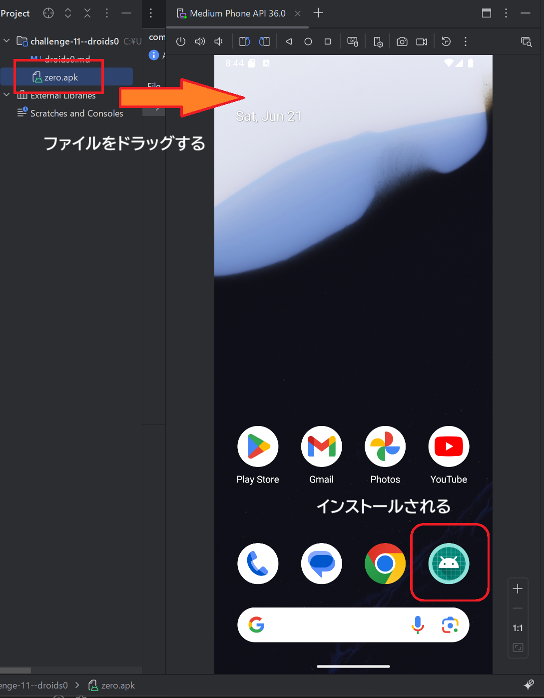
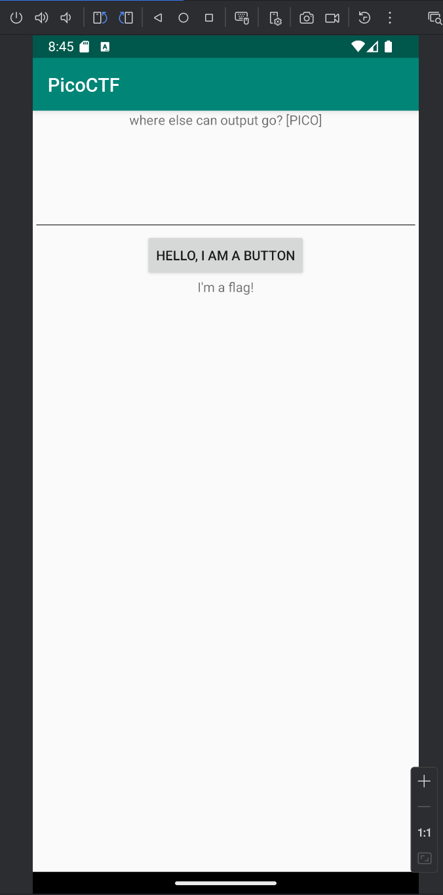
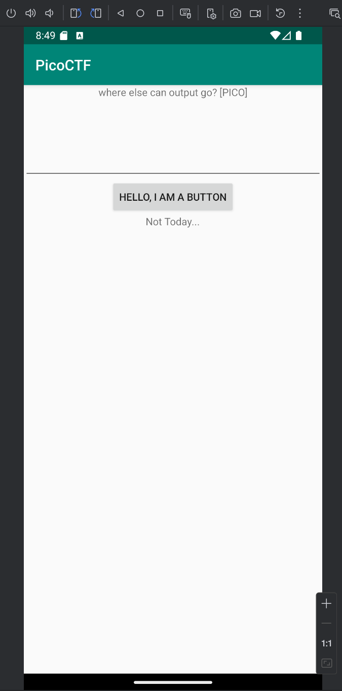
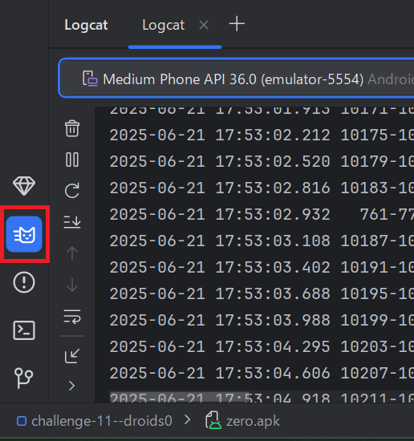
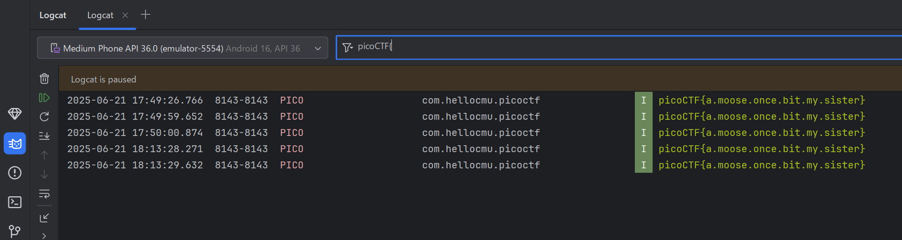

# droids0
Author: Jason  

### URL
https://play.picoctf.org/practice/challenge/11  

### Description
Where do droid logs go. Check out this file.  

<br>
<br>
<br>
<br>

## 解答の過程
fileのリンクをクリックするとファイルをダウンロードすることができます。ファイル名は「zero.apk」です。  

Linuxのfileコマンドで確認したところ、以下の結果が得られました。  
```
$ file zero.apk
zero.apk: Android package (APK), with APK Signing Block
```
拡張子がapkのファイルは、Androidのパッケージファイルです。  

ヒントには、エミュレーターかデバイスを使うこと、そして、Android Studioへのリンクが書かれていました。Android Studioの開発環境でファイルを見るか、または、Androidの端末にzero.apkをインストールすることでフラグへの手がかりが得られそうです。  

Android Studioのサイトへアクセスすると、クラウド版がリリースされていました（2025年6月時点）。ローカルにインストールする必要がないため気軽に使えるかと思ったのですが、リソースが混みあっているようで動作しませんでした。そのため、Android Studioをダウンロードして、ローカルマシンにインストールしました。  

Android Strudioを起動して、メニューでzero.apkを指定し、新規のプロジェクトとして開きます。  
次に、エミュレーターを起動して仮想デバイスの画面が表示されたら、左ペインからzero.apkをドラッグして仮想デバイスの画面上に持っていきます。これでzero.apkが仮想デバイスにインストールされます。  


zero.apkが仮想デバイスにイントールされたら、タップして実行します。すると「HELLO, I AM A BUTTON」という直接的な表現のボタンを持つシンプルなアプリ画面が表示されます。  


ボタンを押すと、「Not Today...」とつれないメッセージが返ってきます。  


画面上部に「Where else can output go? [PICO]」と記載されていることから、どこか別の場所に出力されていることが推測されます。問題文にも「ドロイドのログはどこへ？」と書かれていますし、Android Studioでログを確認します。  

Android Studioでは、Logcatと呼ばれるツールが存在しており、画面左下に猫のアイコンで用意されています（下図の赤枠で囲ったアイコン）。  


Logcatを起動すると、仮想デバイスのログが出力されます。次から次へとログが出力されてくるので、一時停止するなどして落ち着かせ、検索バーに「picoCTF{」まで入力すると絞り込まれてフラグを確認することができます。  


ボタンを押した回数だけフラグがログに出力されています。  


## フラグ
> picoCTF{a.moose.once.bit.my.sister}


## この問題は
Androidのアプリケーションをエミュレーターで動作させ、開発環境の扱い方を学ぶことができます。  
また、アプリケーションの重要な出力を安全でないストレージに保管してはいけないことを教えるものとなっているようです。  

参考：[OWASP Mobile TOP 10 - M9: Insecure Data Storage](https://owasp.org/www-project-mobile-top-10/2023-risks/m9-insecure-data-storage.html)  
