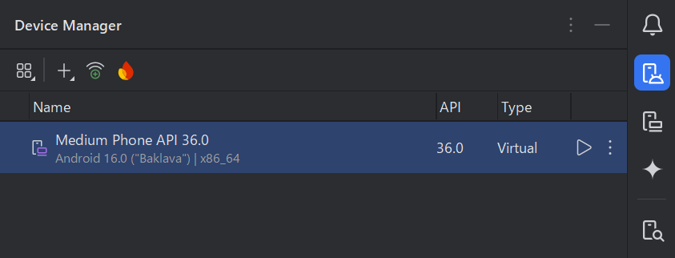
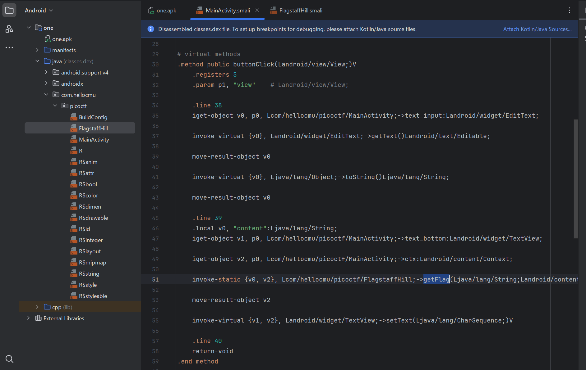
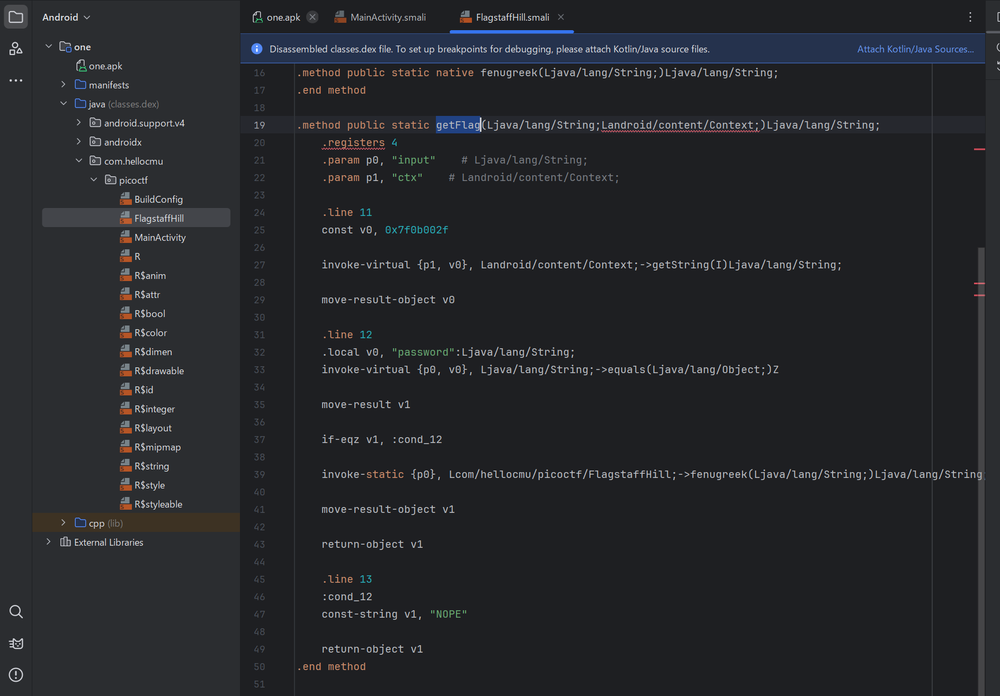
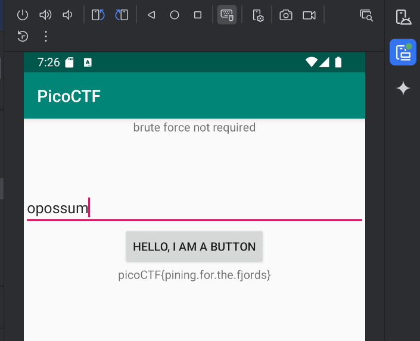

# droids1
Author: Jason  

### URL
https://play.picoctf.org/practice/challenge/14  

### Description
Find the pass, get the flag. Check out this file.  

<br>
<br>
<br>
<br>

## 解答の過程
fileの箇所をクリックするとファイルをダウンロードすることができます。ファイル名は「one.apk」です。  
Linuxのfileコマンドで確認すると、Androidのパッケージであることが分かります。  

```
$ file one.apk
one.apk: Android package (APK), with APK Signing Block
```

Android Studioを使ってパッケージを確認してみます。  

#### ◆ Android Studioでの調査
Android Studioを起動して、File＞Profile or Debug APKと進み、ファイルダイアログでone.apkを選択して開きます。  


Android Studioの右側のペインから、Device Managerを選択し、用意してあるデバイスを起動します。  


デバイスが起動するとメイン画面が表示されるので、「one.apk」ファイルをドラッグしてアプリケーションをインストールします。  
アプリケーションが起動すると、シンプルなテキスト入力欄とボタンが表示されたアプリケーション画面が表示されました。  
どうやら、意図されたテキストを入力してボタンを押すと、フラグが表示される仕組みのようです。  


画面構成が分かったので、ソースコードから手掛かりになるものを探していきます。  
まず、one＞java＞com.hellocmu＞picoctfと辿っていくことで、MainActivityのソースコードを見つけることができます。  
このソースコードの中から、ボタンに関するコードを探します。  
すると、buttonClick()メソッドがあり、そのメソッドの中でgetFlag()メソッドが呼び出されているのを見つけることができます。  


次に、getFlag()メソッドを実装している箇所を探します。  
検索機能などを上手に使いながら探していくと、one＞java＞com.hellocmu＞picoctfのFlagstuffHillに記述されているのを見つけることができ、passwordという記載がありました。そして、このpasswordは0x7f0b002fで定義されているようです。  


そこで、0x7f0b002fで定義されている内容を確認するために、中央のペインに表示されているone.apkのファイル構成の中からresources.arscファイルを選択します。  
下部のエリアにリソースの構成が表示されるので、0x7f0b002fの箇所を探していきます。  
passwordには、「opossum」というワードが定義されていることを見つけました。  


エミュレーター上で実行しているアプリケーションのテキスト欄に、見つけた「opossum」を入力し、「HELLO, I AM A BUTTOM」ボタンを押します。  
フラグが表示されました。  


<br>
<br>
<br>
<br>

## フラグ
picoCTF{pining.for.the.fjords}  

<br>
<br>

## この問題は
Androidのアプリケーションをエミュレーターで動作させ、開発環境の扱い方を学ぶことができます。  
