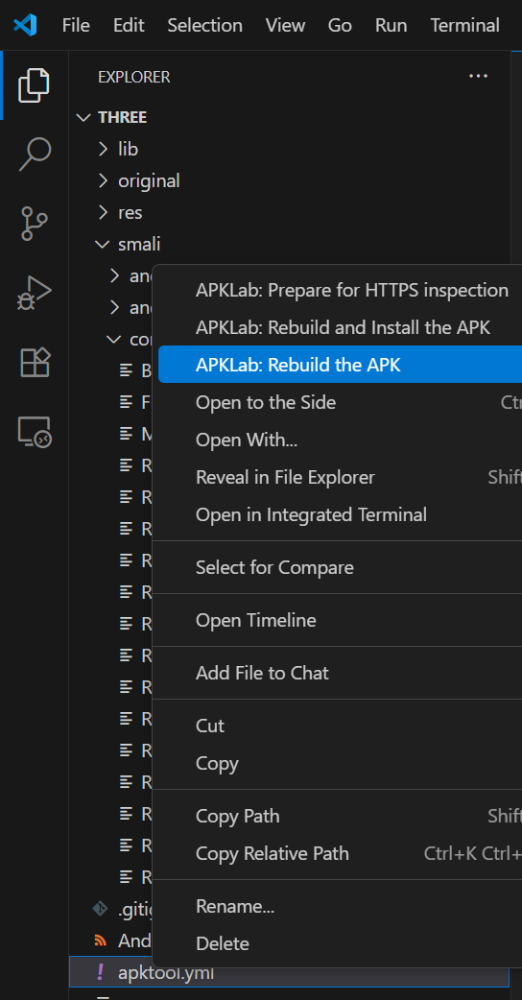
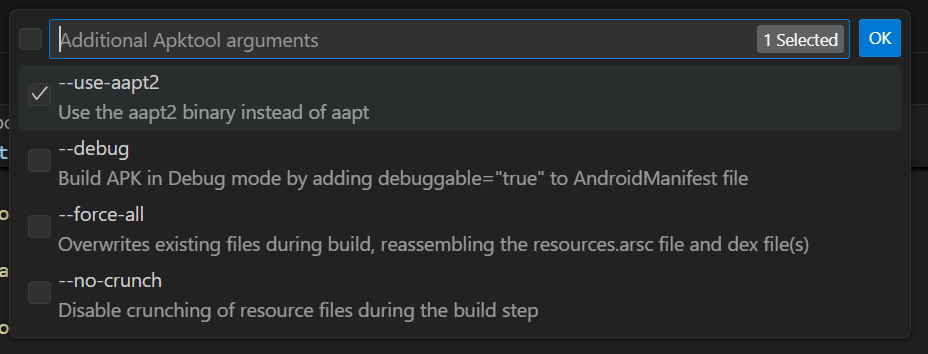
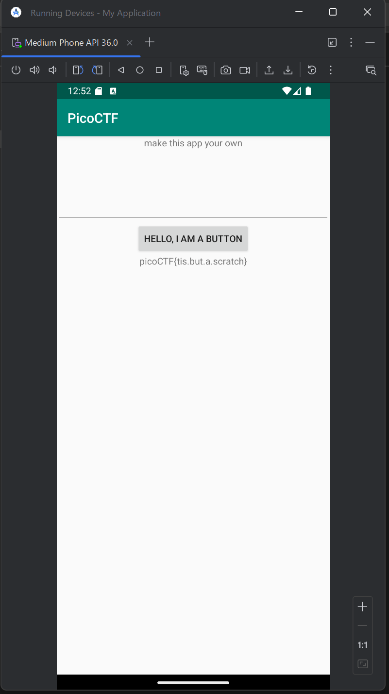

# droids3
Author: Jason  

#### URL
https://play.picoctf.org/practice/challenge/23  

#### Description
Find the pass, get the flag. Check out this file.  

<br>
<br>
<br>
<br>

## 解答の過程
リンクになっている「file」をクリックするとファイルをダウンロードすることができます。  
ファイル名は「three.apk」であり、Androidのパッケージファイルだと分かります。  
Linux上でfileコマンドも使用して、Androidのパッケージファイルであることを確認します。  

```
$ file three.apk
three.apk: Android package (APK), with APK Signing Block
```

そのため、Android Studioを使用して、ファイルを確認していきます。  

### Android Studio
Android Studioを起動し、適当に（空の）プロジェクトを準備します。  
プロジェクトが準備できたら、仮想デバイスを起動します。  
仮想デバイスのホーム画面が表示されたら、Windowsの場合エクスプローラーから「three.apk」をホーム画面上にドラッグすることで仮想デバイス上にアプリケーションをインストールできます。  
そして、アプリケーションを起動します。  

下図のような画面で「make this app your own」と記述されているのが気になります。  


入力する内容も分からないので、適当に入力してボタンを押しても、当然フラグは表示されません。「don't wannna」と表示されます。  

そこで、どのようなコードが記述されているか、確認してみます。  

Android Studioのメニューから「File」＞「Profile or Debug APK」と進めて、three.apkファイルを読み込みます。  
新しいウインドウが開いて、左側のファイル構成の中から、「three」＞「java」＞「com.hellocmu」＞「picoctf」＞「MainActivity」と選択します。  

MainActivity.smaliファイルにて、ボタンを押したときに呼び出す関数がFlagstaffHillのgetFlag()であることが分かります。  


今度は、FlagstaffHillのgetFlag()を見てみます。getFlag()の処理の中でnope()を呼び出している記述が存在しています。  
getFlag()のコードでは、nope()があり、さらにyep()が存在しています。このyep()の中でcilantro()を呼び出しているのを確認できます。  


yep()はどこから呼び出されるのでしょうか？  
Android Studioの検索機能を利用して、パッケージファイル全体を検索してみますが、yep()を呼び出す処理が存在していません。  
このことより、アプリケーション内でyep()を呼び出すようにコードを改変してやれば、cilantro()へ進み、フラグが得られるのではないかと考えられます。  
getFlag()の中でnope()を呼び出しているので、nopeをyepに変えてやれば実現できそうです。  

そして、ヒントにはapktoolの利用が記載されています。apktoolはAndroidアプリを解析・改造するためのリバースエンジニアリングツールなので、まさしくthree.apkのコードを改変することを示しています。  
なお、ここではapktoolではなく、VSCodeの拡張機能であるAPKLabを使用します。  

### APKLabでの作業
APKLabはVSCodeの拡張機能として提供されています。  
VSCodeにAPKLabをインストールし、コマンドパレットを開いて（Ctrl + Shift + P）、APKLabを起動します（「APKLab: Open an APK」を選択）。  


起動すると、APKファイルを選択するウインドウが表示されるので「three.apk」を選択します。  
Additional featureとしてオプションを選択するウインドウが表示されます。「--no-res」と「--only-main-classes」にチェックを入れて、OKボタンを押します。  
（※「--no-res」にチェックを入れないで読み込むと、再ビルド時にファイルが不足するエラーとなり、先に進めなくなります。）  


読み込んだ「three.apk」が存在する場所に「three」フォルダーが作成され、新しいウインドウが開きます。  
左ペインのEXPLORER内には、three.apkファイルの構成が表示されています。  


「THREE」＞「smali」＞「com\hellocmu\picoctf」＞「FlagstaffHill.smali」と選択し、コードを表示させます。  
ここでの目的は、以下のコード部分で、nopeをyepに変えることです。  

```
.line 19
invoke-static {p0}, Lcom/hellocmu/picoctf/FlagstaffHill;->nope(Ljava/lang/String;)Ljava/lang/String;

    ↓

.line 19
invoke-static {p0}, Lcom/hellocmu/picoctf/FlagstaffHill;->yep(Ljava/lang/String;)Ljava/lang/String;
```

編集できたら、左側ペインのファイル構成から「「apktool.yml」を右クリックして、表示されるポップアップメニューから「APKLab: Rebuild the APK」を選択します。  



次に出てくるAdditional Apktool argumentsはそのままにしてOKボタンを押します。  



ツールの処理が走り、再ビルドと署名を実施します。  
処理が終了すると、threeフォルダー内にdistフォルダーが用意されており、その中にビルドされたthree.apkファイルがあります。  

仮想デバイスにインストールし、実行します。  
パスワードを入力してボタンを押すと、フラグが出力されます。  



<br>
<br>
<br>
<br>

## フラグ
picoCTF{tis.but.a.scratch}  

<br>
<br>

## この問題は
Androidアプリのリバースエンジニアリングについて勉強できます。  
