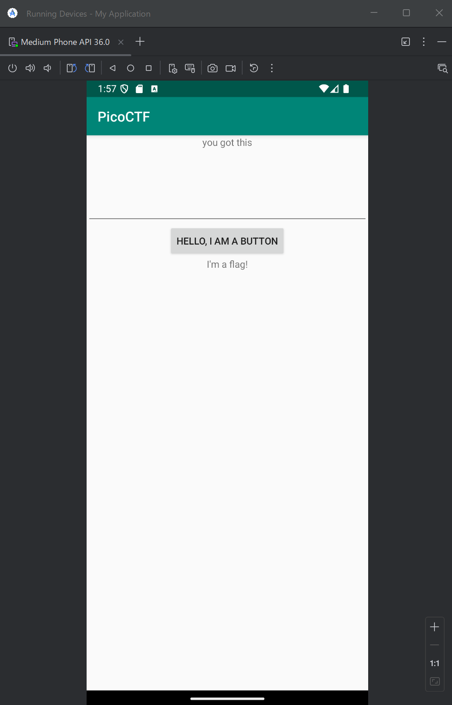
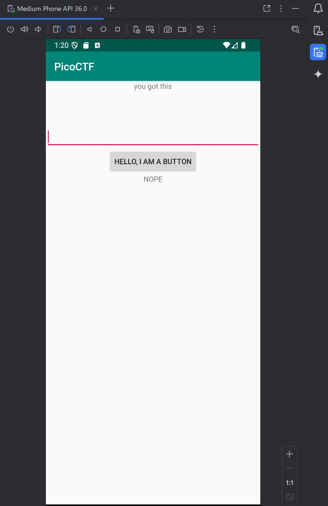
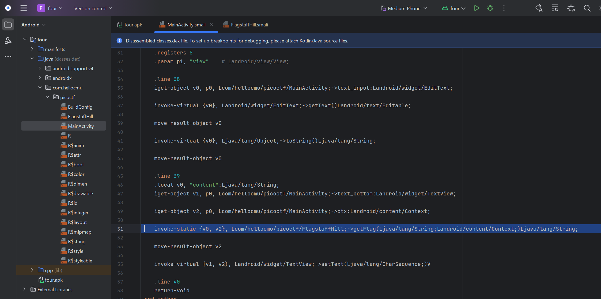
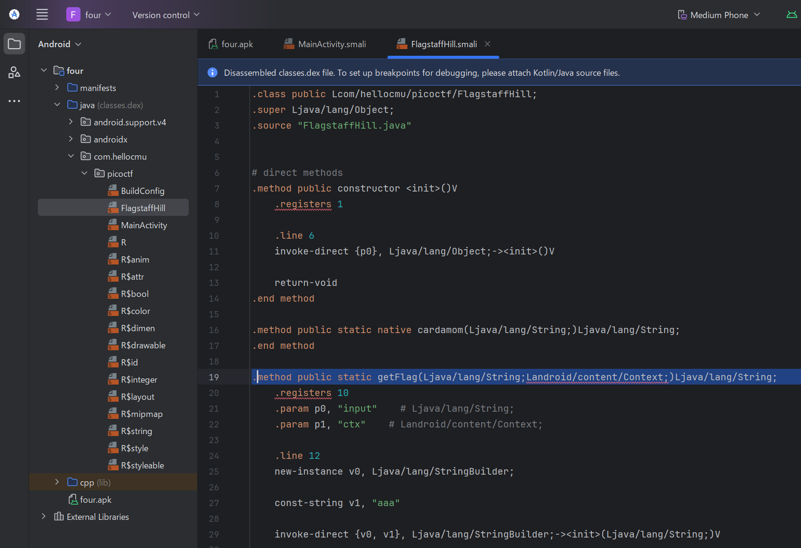
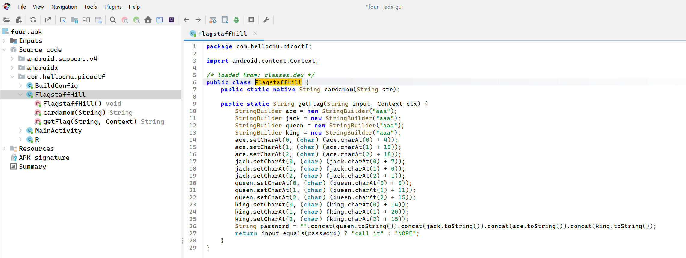
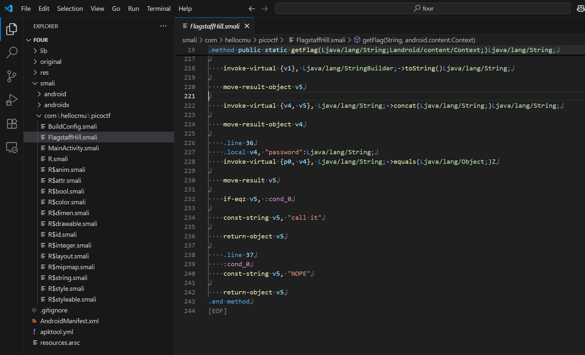
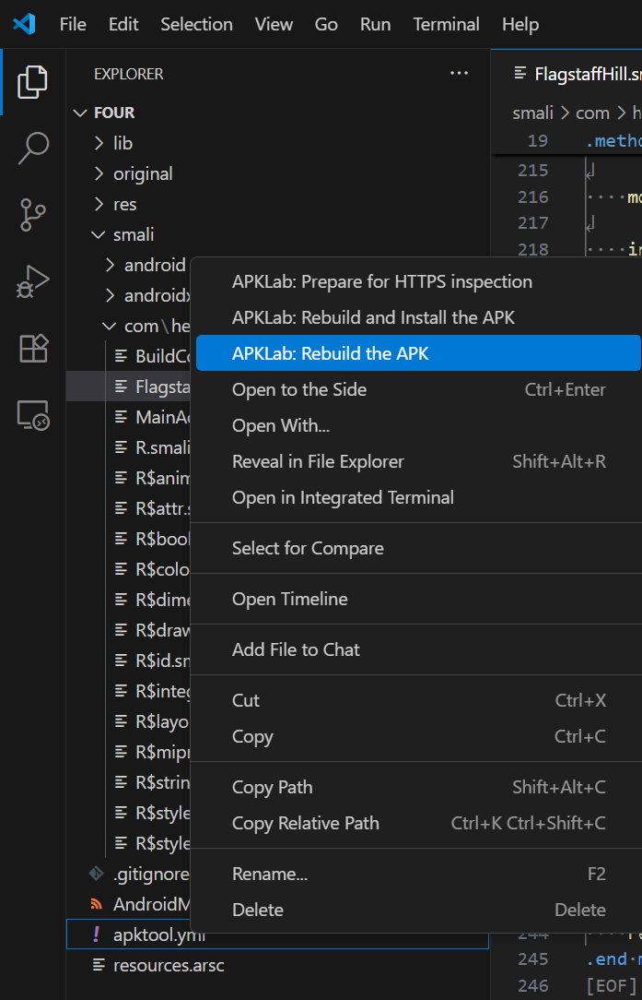
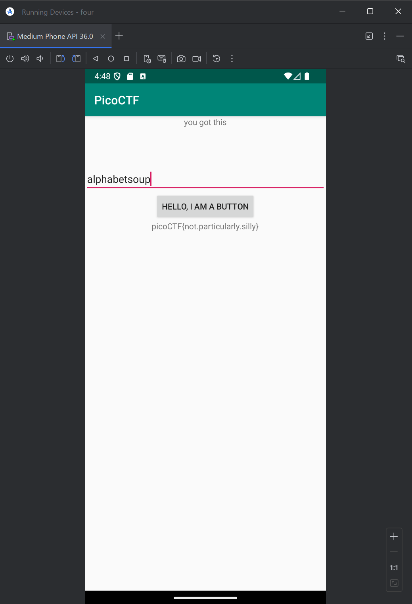

# droids4
Author: Jason  

#### URL
https://play.picoctf.org/practice/challenge/17  

#### Description
Reverse the pass, patch the file, get the flag. Check out this file.  

<br>
<br>
<br>
<br>

## 解答の過程
fileのリンクをクリックするとファイルをダウンロードすることができます。  
ファイル名は「four.apk」です。  
拡張子がapkなので、Android Studioを使って確認します。  

<br>

### Android Studioでアプリの動きを確認する
Android Studioを起動し、適当に新しいプロジェクトを作成します。  
デバイスマネージャーでMedium Phoneの仮想デバイスを起動し、four.apkをインストールします。four.apkのアプリは、エクスプローラーでfour.apkファイルを選択し、仮想デバイス上の画面に直接ドラッグすることでインストールできます。  
アプリを起動したのが下図の画面で、ボタンを押すと「Nop」と表示されます。正しいメッセージを入力する必要があることが分かります。  





次に、コードを確認します。  
「File」＞「Profile or Debug APK」でfour.apkファイルを読み込みます。  
新しいウインドウが開くので、左側のファイル構成の中から「four」＞「java」＞「com.hellocmu」＞「picoctf」＞「MainActivity」と選択します。  
MainActivity.smaliファイルのコードからボタンを押したときに呼び出す関数を探すと、FlagstaffHillのgetFlag()であることが分かります。  



次に、FlagstaffHill.smaliファイルを見ると、getFlag()で長々とコードが書かれていることが分かります。  
下の方にスクロールしていき、getFlag()のコード最後部を見てみると、「password」のテキストとequal()が見られます。パスワードの一致を判断する処理であることが分かります。  
そして、「call it」と「NOPE」のテキストも確認できます。  
「NOPE」は、パスワードを間違えたときなどに表示されるテキストであることが分かっているので、パスワードを正しく入力できたときは「call it」が表示されることが分かります。  




したがって、パスワードを見つけ出してもフラグを得ることはできず、何か別の方法が必要ということになります。  

改めてFlagstaffHill.smaliファイルを見ると、getFlag()の上にcardamom()関数が存在していることに気付きます。  

「cardamon」をキーワードにしてapk内を検索してみても、cardamon()を呼び出すコードが存在していません。  
どうやら、「call it」というのは、この場所でcardamon()を呼び出すことを示しているようです。  

つまり、以下の流れで進めれば解決できそうです。  
- getFlag()の処理を解析してパスワードを取得する  
- "call it"の部分でcaramon()を呼び出す  

そのためには、FlagstaffHill.smaliのコードをデコンパイルして編集し、再コンパイル、ビルド、実行できるようにする必要があります。  

まずは、パスワードの取得かさ作業を進めます。  

<br>

### パスワードの取得
FlagstaffHill.smaliのデコンパイルは、JADXを使用します。  
JADX: https://github.com/skylot/jadx  

JADXを起動し、「four.apk」ファイルを開きます。  
左側ペインから「Source code」＞「com.hellocmu.picoctf」＞「FlagstaffHill()」と選択します。  
デコンパイルされたJavaコードが表示されるので、内容を確認します。  



getFlag()は以下のようにデコンパイルされていました。  

```
public static String getFlag(String input, Context ctx) {
    StringBuilder ace = new StringBuilder("aaa");
    StringBuilder jack = new StringBuilder("aaa");
    StringBuilder queen = new StringBuilder("aaa");
    StringBuilder king = new StringBuilder("aaa");
    ace.setCharAt(0, (char) (ace.charAt(0) + 4));
    ace.setCharAt(1, (char) (ace.charAt(1) + 19));
    ace.setCharAt(2, (char) (ace.charAt(2) + 18));
    jack.setCharAt(0, (char) (jack.charAt(0) + 7));
    jack.setCharAt(1, (char) (jack.charAt(1) + 0));
    jack.setCharAt(2, (char) (jack.charAt(2) + 1));
    queen.setCharAt(0, (char) (queen.charAt(0) + 0));
    queen.setCharAt(1, (char) (queen.charAt(1) + 11));
    queen.setCharAt(2, (char) (queen.charAt(2) + 15));
    king.setCharAt(0, (char) (king.charAt(0) + 14));
    king.setCharAt(1, (char) (king.charAt(1) + 20));
    king.setCharAt(2, (char) (king.charAt(2) + 15));
    String password = "".concat(queen.toString()).concat(jack.toString()).concat(ace.toString()).concat(king.toString());
    return input.equals(password) ? "call it" : "NOPE";
}
```

どうやら、「aaa」の文字コードに所定の数値を足すことによって変換、最後に連結させることでパスワードにしているようです。  
この処理によって、以下の文字列を取得できます。これがパスワードになります。  

```
alphabetsoup
```

仮想デバイス上のアプリでこのパスワードを入力し、ボタンを押すと「call it」と表示されるのを確認できます。  


次は、FlagstaffHill.smaliのcall itの箇所を編集し、再コンパイル、ビルド、実行できるようにすることです。  
この作業は、APKLabというツールを利用しました。  
APKLab: https://apklab.surendrajat.xyz/  

### APKLabでの作業
APKLabはVSCodeの拡張機能として提供されています。  
VSCodeにAPKLabをインストールし、コマンドパレットを開いて（Ctrl + Shift + P）、APKLabを起動します（「APKLab: Open an APK」を選択）。  


起動すると、APKファイルを選択するウインドウが表示されるので「four.apk」を選択します。  
Additional featureとしてオプションを選択するウインドウが表示されます。「--no-res」と「--only-main-classes」にチェックを入れて、OKボタンを押します。  
（※「--no-res」にチェックを入れないで読み込むと、再ビルド時にファイルが不足するエラーとなり、先に進めなくなります。）  


読み込んだ「four.apk」が存在する場所に「four」フォルダーが作成され、新しいウインドウが開きます。  
左ペインのEXPLORER内には、four.apkファイルの構成が表示されています。  



「FOUR」＞「smali」＞「com\hellocmu\picoctf」＞「FlagstaffHill.smali」と選択し、コード最下方までスクロールさせます。  

ここでの目的は、以下のコード部分で、cardamon()を呼び出すようにすることです。  

```
if-eqz v5, :cond_0

const-string v5, "call it"

return-object v5
```

関数を呼び出す部分のコードを周辺の記述を参考にして、以下のように編集します。  

```
if-eqz v5, :cond_0

#const-string v5, "call it"
invoke-static {p0}, Lcom/hellocmu/picoctf/FlagstaffHill;->cardamom(Ljava/lang/String;)Ljava/lang/String;
move-result-object v5

return-object v5
```

cardamon()に渡している引数（p0）は、パスワード文字列「alphabetsoup」になります。アプリのテキスト入力部分に記述する文字列です。  
編集したら、左側ペインから「apktool.yml」を右クリックして、表示されるポップアップメニューから「APKLab: Rebuild the APK」を選択します。  



次に出てくるAdditional Apktool argumentsはそのままにしてOKボタンを押します。  


ツールの処理が走り、再ビルドと署名を実施されます。  
処理が終了すると、fourフォルダー内にdistフォルダーが用意されており、その中にビルドされたfour.apkファイルがあります。  
仮想デバイスにインストールし、実行します。  
パスワードを「alphabetsoup」入力してボタンを押すと、フラグが出力されます。  



<br>
<br>
<br>
<br>

## フラグ
picoCTF{not.particularly.silly}  


## この問題は
androidアプリのリバースエンジニアリングについて勉強できます。  

