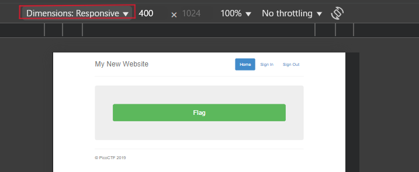

# picobrowser
Author: Archit  

### URL
https://play.picoctf.org/practice/challenge/9  

### Description
This website can be rendered only by **picobrowser**, go and catch the flag! `https://jupiter.challenges.picoctf.org/problem/28921/` ([link](https://jupiter.challenges.picoctf.org/problem/28921/)) or http://jupiter.challenges.picoctf.org:28921  

<br>
<br>

## 解答の過程
linkをクリックしてChromeブラウザーでサイトにアクセスすると、「Flag」と書かれた大きな緑色のボタンがあるシンプルなページが表示されます。  
「Flag」ボタンを押すと、以下のようなエラーメッセージが表示されます。  

```
You're not picobrowser! Mozilla/5.0 (Windows NT 10.0; Win64; x64) AppleWebKit/537.36 (KHTML, like Gecko) Chrome/137.0.0.0 Safari/537.36
```

どうやら、ブラウザーの種類が異なるために、先に進まないようです。  
「You're not picobrowser!」の後に記載されている「Mozilla/5.0・・・」は、Chromeブラウザーのユーザーエージェントになっていました。  

このページでは、他に「Sign In」と「Sign Out」のメニューがあります。しかし、クリックしても「実装していない」というエラーメッセージが表示されました。  

このことより、picobrowserでサイトにアクセスして「Flag」ボタンを押すことができれば、フラグを取得できると考えられます。  

Chromeでは、開発者ツールを使用してユーザーエージェントを変更することができます。  

Chromeで当該サイトにアクセス、開発者モードを起動して「Settings」→「Devices」→「Add custom device」へと進むと、カスタムデバイスの登録とデフォルトデバイスの選択ページが表示されます。  
ここで、「Add custom device」を選択し、表示される入力項目の中から、Device欄に適当なデバイス名を入力し、User agent string欄に「picobrowser」と入力します。他の項目はそのままで「Add」ボタンを押して登録します。  
これで、カスタムのブラウザーを用意することができました。  

開発ツールのSettingsを終了し、開発ツール画面左上にある「Toggle Device Toolbar」をクリックします。サイトの画面が各種デバイスによるページ表示に切り替わります。  
ページ上部のメニューに「Dimensions: Responsive」と書かれている部分があるので、クリックするとSettingsで作成したデバイスを選択することができます（下図赤枠の部分）。  



先ほど作成したpicobrowser用のデバイスを選択することで、ページの画面がpicobrowserデバイスでの表示に切り替わります。  

この状態で「Flag」ボタンを押すと、下の図のようにユーザーエージェントとして「picobrowser」をサイトへ送信します（下図赤枠の部分）。当該ページでのブラウザーチェックを通過してフラグを出力したページが表示されます。  


<br>
<br>
<br>
<br>

## Flag
> picoCTF{p1c0_s3cr3t_ag3nt_84f9c865}  

<br>
<br>

## この問題は
ユーザーエージェントについて学ぶ問題のようです。  

なお、curlコマンドを使う場合は、--user-agentオプションで「picobrowser」と記述します。レスポンスのhtml内にフラグが記載されています。  

> curl -v --user-agent "picobrowser" http://jupiter.challenges.picoctf.org:28921

```
> curl -v --user-agent "picobrowser" http://jupiter.challenges.picoctf.org:28921/flag
* Host jupiter.challenges.picoctf.org:28921 was resolved.
* IPv6: (none)
* IPv4: 3.131.60.8
*   Trying 3.131.60.8:28921...
* Connected to jupiter.challenges.picoctf.org (3.131.60.8) port 28921
* using HTTP/1.x
> GET /flag HTTP/1.1
> Host: jupiter.challenges.picoctf.org:28921
> User-Agent: picobrowser
> Accept: */*
>
* Request completely sent off
< HTTP/1.1 200 OK
< Content-Type: text/html; charset=utf-8
< Content-Length: 2115
< Set-Cookie: session=; Expires=Thu, 01-Jan-1970 00:00:00 GMT; Max-Age=0; Path=/
<
<!DOCTYPE html>
<html lang="en">

<head>
    <title>My New Website</title>


    <link href="https://maxcdn.bootstrapcdn.com/bootstrap/3.2.0/css/bootstrap.min.css" rel="stylesheet">

    <link href="https://getbootstrap.com/docs/3.3/examples/jumbotron-narrow/jumbotron-narrow.css" rel="stylesheet">

    <script src="https://ajax.googleapis.com/ajax/libs/jquery/3.3.1/jquery.min.js"></script>

    <script src="https://maxcdn.bootstrapcdn.com/bootstrap/3.3.7/js/bootstrap.min.js"></script>

</head>

<body>

    <div class="container">
        <div class="header">
            <nav>
                <ul class="nav nav-pills pull-right">
                    <li role="presentation" class="active"><a href="/">Home</a>
                    </li>
                    <li role="presentation"><a href="/unimplemented">Sign In</a>
                    </li>
                    <li role="presentation"><a href="/unimplemented">Sign Out</a>
                    </li>
                </ul>
            </nav>
            <h3 class="text-muted">My New Website</h3>
        </div>

       <!-- Categories: success (green), info (blue), warning (yellow), danger (red) -->


       <div class="alert alert-success alert-dismissible" role="alert" id="myAlert">
         <button type="button" class="close" data-dismiss="alert" aria-label="Close"><span aria-hidden="true">&times;</span></button>
         <!-- <strong>Title</strong> --> picobrowser!
           </div>


        <div class="jumbotron">
            <p class="lead"></p>
            <p style="text-align:center; font-size:30px;"><b>Flag</b>: <code>picoCTF{p1c0_s3cr3t_ag3nt_84f9c865}</code></p>
            <!-- <p><a class="btn btn-lg btn-success" href="admin" role="button">Click here for the flag!</a> -->
            <!-- </p> -->
        </div>


        <footer class="footer">
            <p>&copy; PicoCTF 2019</p>
        </footer>

    </div>
    <script>
    $(document).ready(function(){
        $(".close").click(function(){
            $("myAlert").alert("close");
        });
    });
    </script>
</body>

</html>* Connection #0 to host jupiter.challenges.picoctf.org left intact
```