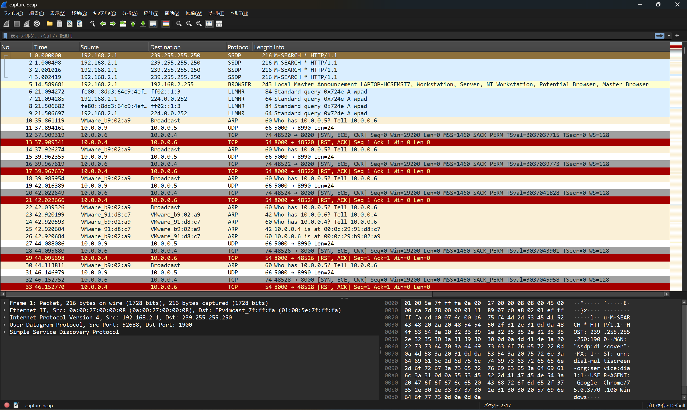
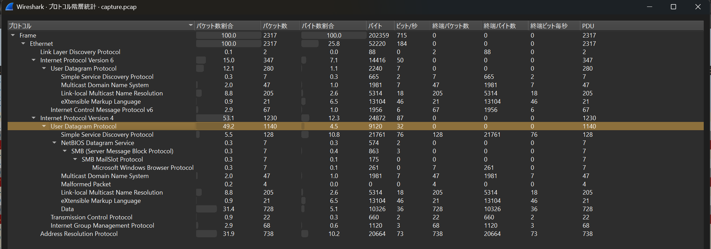
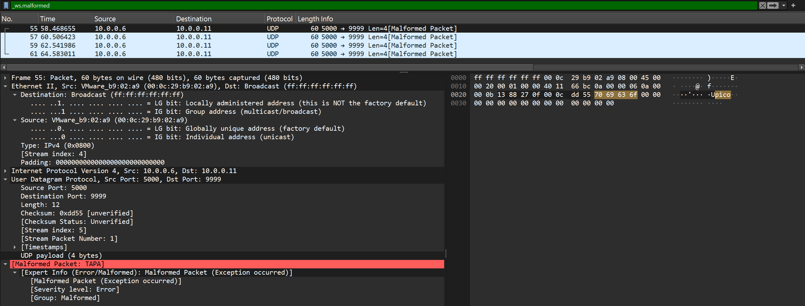
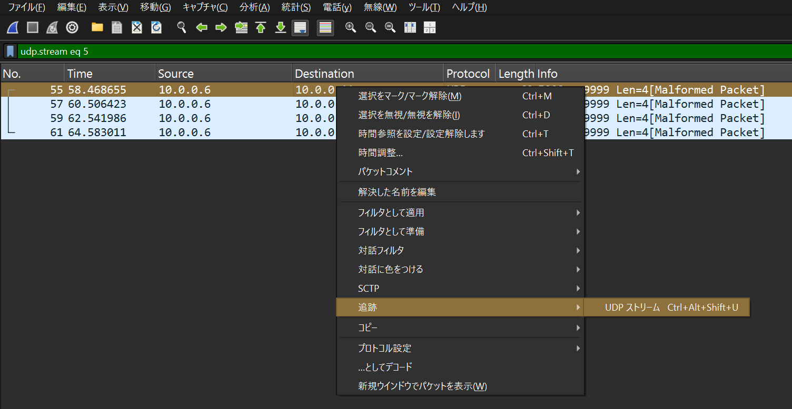
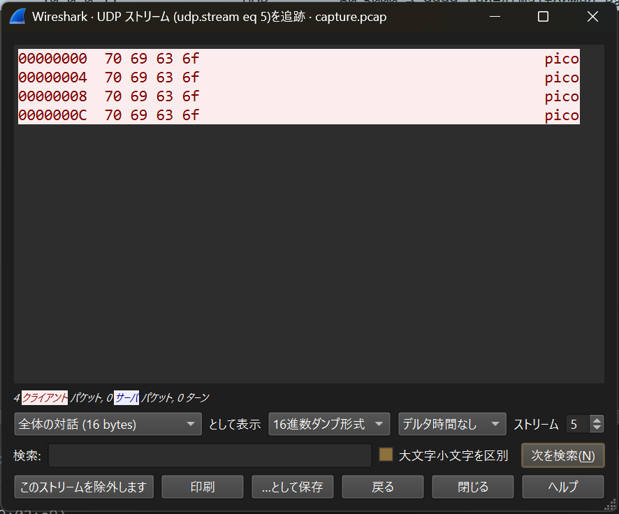
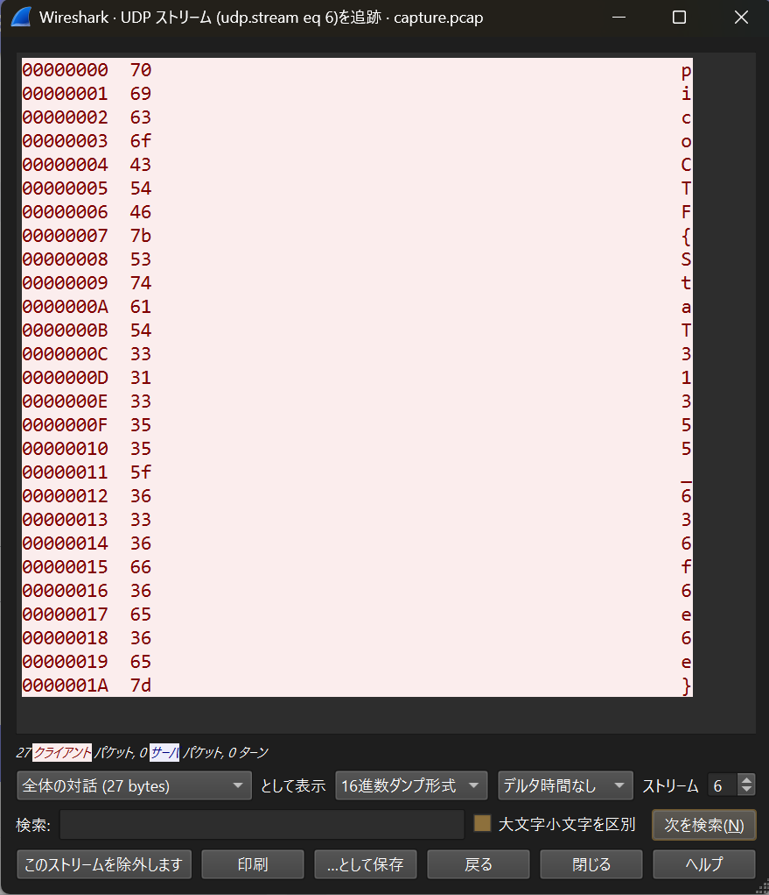
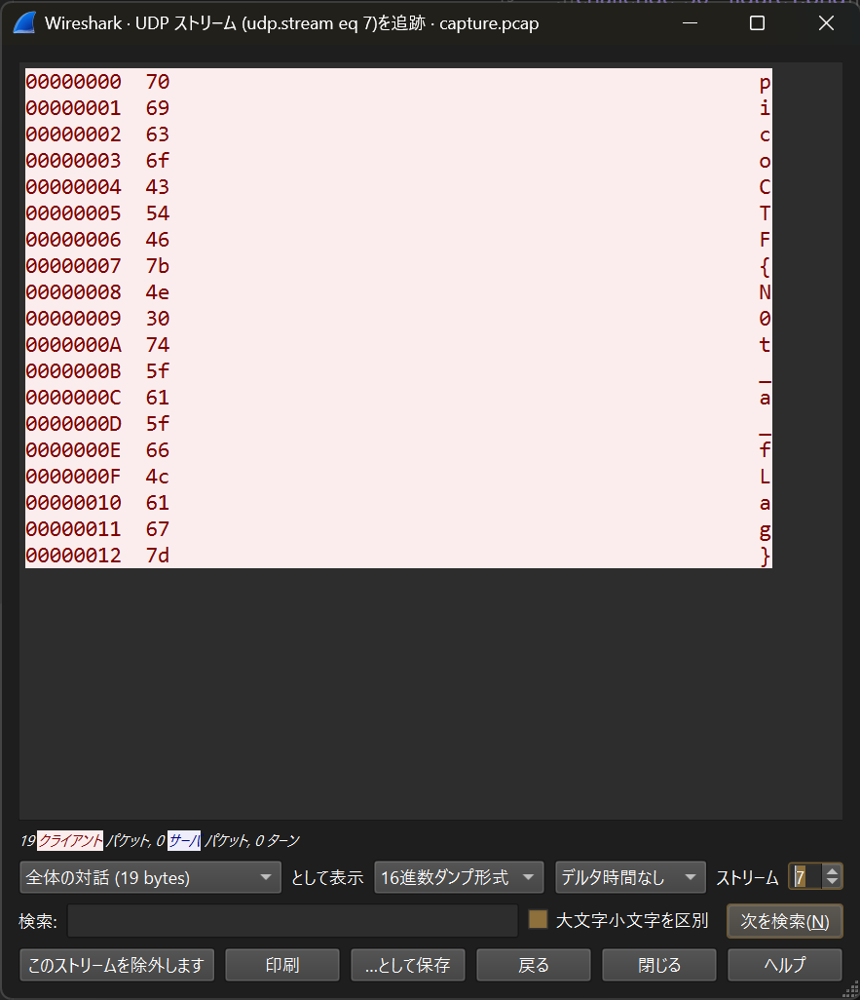

# shark on wire 1
Author: Danny  

#### URL
https://play.picoctf.org/practice/challenge/30  

#### Description
We found this packet capture. Recover the flag.  

 
 
 
 

## 解答の過程
「packet capture」のリンクをクリックするとファイルをダウンロードすることができます。  
ファイル名は「capture.pcap」です。拡張子がpcapなので、Wiresharkを使ってファイルを見てみます。  
以下の図が、Wiresharkを起動して、capture.pcapを開いた画面です。  

2317個のパケットが記録されており、かなりのボリュームです。  
このパケットデータにフラグに関する情報が存在していると考えられます。  
そこで、パケットの傾向を調べることにします。メニューから「統計」→「プロトコル階層」と選択してキャプチャーデータの利用プロトコルの状況を確認します。  
プロトコル階層統計のウィンドウが表示されるので、内容を見てみると、IPv4のUDPが圧倒的に多く、その中には「Malformed Packet」が存在しています。  

Malformed Packetの箇所をマウスで右クリックしてフィルターを設定し、メイン画面でデータを確認すると、パケットのデータ部分に「pico」となるテキストデータが存在していました。  

そして、ヒントを参照すると、「ストリームとは何か？」という記載があるので、IPv4のUDPデータグラムをストリームとして調査していくのが良さそうです。  
メイン画面上のパケットデータをマウスで右クリックし、出てくるポップアップメニューから「追跡」→「UDPストリーム」を選択します。  

UDPストリームの内容を示すウィンドウが表示されます。  

ウィンドウ右下にある「ストリーム」と書かれている右側の数値を変えていくと、キャプチャーされたUDPストリームのグループを切り替えてくれます。数値を下げればパケット番号が小さくなる方向でグループを選択していき、数値を上げればパケット番号が大きくなる方向のグループを選択していきます。  
Malformed PacketのUDPストリームはパケット番号55番だったので、これ以降のUDPストリームを見ていくべきでしょう。  
数値を上げて内容を確認していくと、すぐにフラグとなるUDPストリームのグループが出てきました。  

ちなみに、さらに数値を上げていくと、「フラグじゃないよ」というメッセージが現れ、これ以降は調査不要と分かるようになっています。  

 
 
 
 

## フラグ
picoCTF{StaT31355_636f6e6e}  

 
 

## この問題は
Wiresharkの使い方を学ぶことができます。  
UDPストリームについて学ぶことができます。  
